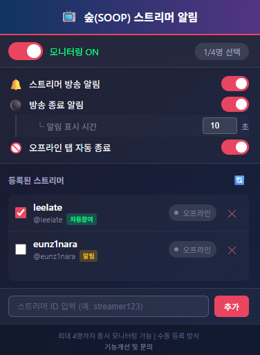

# 📺 숲토킹 - SOOP 스트리머 방송 알림

숲(SOOP, 구 아프리카TV) 즐겨찾기 스트리머의 방송 시작을 자동으로 감지하여 알려주는 Chrome 확장 프로그램입니다.

> **숲토킹** = 숲(SOOP) + 스토킹 🔍 내가 좋아하는 스트리머를 놓치지 않고 챙겨보세요!

---

## 📥 설치 방법

### Chrome 웹스토어에서 설치 (권장)

[Chrome 웹스토어](https://chromewebstore.google.com/detail/bmmihbljmhbmhkijinicehdbjlinalfi)에서 "숲토킹"을 검색하거나 링크를 클릭하여 바로 설치할 수 있습니다.

### 수동 설치

1. 이 확장 프로그램 파일을 [다운로드](https://github.com/musickiss/soop-streamer-alert/archive/refs/heads/master.zip)하고 압축을 풉니다.
2. 브라우저 주소창에 확장 프로그램 주소를 입력하고 이동합니다.
   - Chrome: `chrome://extensions/`
   - Edge: `edge://extensions/`
   - Brave: `brave://extensions/`
3. 우측 상단의 **"개발자 모드"**를 활성화합니다.
4. **"압축해제된 확장 프로그램을 로드합니다"** 버튼을 클릭합니다.
5. 압축 해제한 `soop-extension` 폴더를 선택합니다.
6. 브라우저 우측 상단에 📺 아이콘이 나타나면 설치 완료!

---

## ✨ 주요 기능

| 기능 | 설명 |
|------|------|
| **자동 참여** | 선택한 스트리머 방송 시작 시 자동으로 탭 열기 |
| **알림 표시** | 나머지 스트리머 방송 시작 시 브라우저 알림 표시 |
| **방송 종료 알림** | 모든 스트리머 방송 종료 시 알림 표시 (옵션) |
| **실행 상태 표시** | 방송 탭이 열려있는지 실시간 표시 |
| **오프라인 탭 자동 종료** | 방송 종료 시 해당 탭 자동 종료 |
| **VOD 자동재생 탭 종료** | 방송 종료 후 리다이렉트되는 다시보기 탭 자동 종료 |
| **중복 탭 방지** | 이미 시청 중인 방송은 새 탭을 열지 않음 |
| **스트리머 목록 내보내기/불러오기** | JSON 파일로 스트리머 목록 백업 및 복원 |
| **드래그 앤 드롭 순서 변경** | 스트리머 목록을 드래그하여 순서 변경 |
| **스테이션 바로가기** | 스트리머 닉네임 클릭 시 스테이션 페이지로 이동 |
| **닉네임 자동 업데이트** | 스트리머 방송 시 닉네임 자동 업데이트 |

---

## 📊 모니터링 방식

이 확장 프로그램은 **세 가지 다른 주기**로 상태를 확인합니다:

| 구분 | 주기 | 대상 | 동작 |
|------|------|------|------|
| **자동참여** | **5초** | 체크박스 선택한 스트리머 | 방송 시작 시 자동 탭 열기 |
| **알림** | **30초** | 체크박스 선택하지 않은 스트리머 | 방송 시작 시 알림 표시 |
| **탭 점검** | **30초** | 모든 즐겨찾기 스트리머 | 탭 실행 상태 확인 및 오프라인 탭 종료 |

---

## 📱 UI 구성



```
┌─────────────────────────────────────┐
│             숲토킹                  │
│      내가 늘 지켜보고 있어..        │
├─────────────────────────────────────┤
│  🔘 모니터링 ON            2명 선택 │
├─────────────────────────────────────┤
│  🔔 스트리머 방송 알림        [ON]  │
│  ⚫ 방송 종료 알림           [OFF]  │
│      └ 알림 표시 시간    [ 10 ] 초  │
│  🚫 오프라인 탭 자동 종료     [ON]  │
├─────────────────────────────────────┤
│  등록된 스트리머                 🔄 │
│  ┌─────────────────────────────────┐│
│  │☑️ 이지각 [자동참여][실행]🔴방송중││
│  │☑️ 양팡♥ [자동참여]      🔴방송중 ││
│  │☐ ekek1004 [알림]     ⚪오프라인 ││
│  └─────────────────────────────────┘│
├─────────────────────────────────────┤
│  [스트리머 ID 입력        ] [추가]  │
└─────────────────────────────────────┘

```

### 뱃지 설명

| 뱃지 | 색상 | 의미 |
|------|------|------|
| `자동참여` | 🟢 초록 | 방송 시작 시 자동으로 탭 열기 |
| `알림` | 🟡 노랑 | 방송 시작 시 알림만 표시 |
| `실행` | 🔵 파랑 | 현재 해당 방송 탭이 열려있음 |
| `미실행` | ⚫ 회색 | 방송중이지만 탭이 열려있지 않음 |

---

## ⚠️ 주의사항 (중요)

### SOOP 동시 시청 제한 (4개)

SOOP은 하나의 브라우저에서 **최대 4개까지만** 동시 스트리밍을 허용합니다.

| 상황 | 확장 프로그램 동작 |
|------|-------------------|
| 현재 0~3개 방송 시청 중 | ✅ 자동참여 스트리머 방송 시작 → **새 탭 열기** |
| 현재 4개 방송 시청 중 | ⚠️ 자동참여 스트리머 방송 시작 → **알림만 표시** |

> 이미 4개 방송을 시청 중이면 자동참여 대신 알림이 표시됩니다.
> 알림을 클릭하면 해당 방송 페이지로 이동할 수 있습니다.

### 스트리머 등록 수 권장 사항

| 등록 수 | 위험도 | 권장 여부 |
|--------|--------|----------|
| 1~10명 | ✅ 안전 | ⭕ 권장 |
| 11~20명 | ⚠️ 주의 | △ 가능하나 주의 |
| 21명 이상 | ❌ 위험 | ✕ 권장하지 않음 |

**⚠️ 경고**: 너무 많은 스트리머를 등록하면 SOOP 서버에서 비정상적인 접근으로 감지될 수 있습니다.

---

## 🖥️ 리소스 사용량

| 항목 | 사용량 | 설명 |
|------|--------|------|
| **메모리** | 약 5~15MB | 일반 웹페이지 1개보다 적음 |
| **CPU** | 0.1% 미만 | 거의 사용하지 않음 |
| **네트워크** | 시간당 ~500KB | 이미지 1장 수준 |
| **배터리** | 영향 없음 | 노트북 사용 시에도 안전 |

---

## 💚 SOOP 서버 영향

이 확장 프로그램은 **SOOP 서비스에 부담을 주지 않도록** 설계되었습니다.

### 트래픽 비교

| 상황 | 1시간 트래픽 | 비교 |
|------|-------------|------|
| **이 확장프로그램** (스트리머 10명 등록) | **~500KB** | 작은 이미지 1장 |
| 방송 1개 시청 (720p) | ~2,500MB | 약 **5,000배** 더 많음 |
| 일반 웹서핑 (1시간) | ~50MB | 약 **100배** 더 많음 |

### 쉬운 비교

```
📷 자동참여 스트리머 4명을 1시간 모니터링할 때 총 트래픽
   = 약 300KB
   = 저화질 JPG 이미지 1장 수준
   = 카카오톡 이모티콘 2~3개 수준
```

### 서버 친화적 설계

| 설계 원칙 | 적용 내용 |
|-----------|-----------|
| **최소 요청** | 방송 여부 확인만 요청 (영상/채팅 데이터 없음) |
| **요청 분산** | 스트리머별 300ms 간격으로 순차 요청 |
| **타임아웃** | 10초 응답 없으면 자동 취소 후 재시도 |
| **이중 주기** | 자동참여(5초) / 알림만(60초) 분리로 불필요한 요청 최소화 |

> 💡 **개발 철학**: 사용자 편의를 위한 기능이지만, 모든 개발 과정에서 SOOP 서비스에 영향을 주지 않는 것을 최우선으로 고려했습니다. 1시간 동안 이 확장프로그램이 사용하는 트래픽은 카카오톡으로 이모티콘 3~4개를 주고받는 수준입니다.

---

## 🔒 보안 및 개인정보 보호

이 확장 프로그램은 **사용자의 개인정보를 절대 수집하지 않습니다.**

- ❌ 로그인 정보 수집 안 함
- ❌ 쿠키/세션 정보 수집 안 함
- ❌ 외부 서버로 데이터 전송 안 함
- ✅ 모든 설정은 브라우저 로컬에만 저장
- ✅ SOOP 공식 API만 사용 (방송 여부 확인)

---

## 💻 지원 환경

이 확장 프로그램은 **데스크톱 전용**입니다.

### ✅ 지원 OS

| OS | 브라우저 | 지원 |
|----|----------|------|
| **Windows** | Chrome, Edge, Brave | ✅ 지원 |
| **macOS** | Chrome, Edge, Brave | ✅ 지원 |
| **Linux** | Chrome, Chromium | ✅ 지원 |

### ❌ 미지원 환경

| 환경 | 이유 |
|------|------|
| **iOS (iPhone, iPad)** | 모바일 브라우저는 Chrome 확장 프로그램 미지원 |
| **Android** | 모바일 브라우저는 Chrome 확장 프로그램 미지원 |

> 📱 **모바일 사용자**는 SOOP 공식 앱을 이용해 주세요.

---

## 🎮 사용 방법

### 스트리머 추가하기

1. 브라우저 우측 상단의 📺 아이콘을 클릭합니다.
2. 하단의 **"스트리머 ID 입력"** 칸에 스트리머 ID를 입력합니다.
   - 예: `https://ch.sooplive.co.kr/streamer123` → ID는 `streamer123`
3. **"추가"** 버튼을 클릭합니다.

### 모니터링 설정하기

1. 등록된 스트리머 목록에서 **자동참여**를 원하는 스트리머의 체크박스를 선택합니다.
   - 체크된 스트리머: **5초 간격** 모니터링, 방송 시작 시 **자동 탭 열기**
   - 체크 안 된 스트리머: **30초 간격** 모니터링, 방송 시작 시 **알림만 표시**
2. 상단의 **토글 스위치**를 ON으로 설정하여 모니터링을 시작합니다.

### 자동 동작 방식

이 확장프로그램은 **상태 변화를 감지**하여 동작합니다.

| 동작 | 트리거 | 설명 |
|------|--------|------|
| **탭 자동 열기** | 오프라인 → 방송중 | 방송 시작 시 **1회만** 자동 참여 |
| **탭 자동 종료** | 방송중 → 오프라인 | 방송 종료 시 **1회만** 탭 종료 |

**의도된 설계:**
- 사용자가 **직접 탭을 닫아도** 다시 열지 않습니다 (방송이 계속 중이면 상태 변화 없음)
- 사용자가 **직접 방송 탭을 열어도** 영향받지 않습니다
- 이미 시청 중인 방송은 **중복으로 탭을 열지 않습니다**

**브라우저 재시작 시:**
- 자동참여 스트리머가 방송 중이면 → 탭 자동 열기
- 이전에 보던 방송이 종료되었으면 → 남아있는 탭 자동 종료

### 설정 옵션

| 옵션 | 설명 | 기본값 |
|------|------|--------|
| **기타 스트리머 알림** | 자동참여가 아닌 스트리머의 방송 알림 | ON |
| **알림 표시 시간** | 알림이 화면에 표시되는 시간 | 10초 |
| **방송 종료 알림** | 방송 종료 시 알림 표시 | OFF |
| **오프라인 탭 자동 종료** | 방송 종료 시 해당 탭 자동 종료 + VOD 자동재생 탭 종료 | ON |

### 스트리머 목록 관리

등록된 스트리머 목록을 백업하거나 다른 브라우저로 이동할 수 있습니다.

| 기능 | 아이콘 | 설명 |
|------|--------|------|
| **내보내기** | ⬆️ (파란색) | 스트리머 목록을 JSON 파일로 저장 |
| **불러오기** | ⬇️ (초록색) | JSON 파일에서 스트리머 목록 복원 |
| **새로고침** | 🔄 (빨간색) | 방송 상태 즉시 새로고침 |

**사용 예시:**
- 브라우저 재설치 전 목록 백업
- 다른 PC로 설정 이동
- 친구와 스트리머 목록 공유

> 💡 불러오기 시 기존 목록에 **추가**됩니다. (덮어쓰기 X)

---

## ❓ FAQ

### Q: "실행" 뱃지는 무슨 의미인가요?
해당 스트리머의 방송 탭이 브라우저에 열려있으면 파란색 "실행" 뱃지가 표시됩니다. 방송중인데 탭이 없으면 회색 "미실행"이 표시됩니다.

### Q: 오프라인 탭 자동 종료는 어떻게 작동하나요?
- 즐겨찾기한 스트리머가 방송을 종료하면 해당 방송 탭이 자동으로 닫힙니다.
- 방송 종료 후 자동으로 리다이렉트되는 다시보기(VOD) 탭도 자동으로 닫힙니다.
- 이 기능은 설정에서 OFF로 변경할 수 있습니다.

### Q: 이미 방송을 보고 있는데 새 탭이 또 열리나요?
아니요. v1.3.0부터 이미 해당 스트리머의 방송을 시청 중이면 새 탭을 열지 않습니다.

### Q: 개인정보가 수집되나요?
**절대 아닙니다.** 이 확장 프로그램은 어떤 개인정보도 수집하지 않으며, 외부 서버로 데이터를 전송하지 않습니다.

---

## 📝 버전 정보

### v1.7.3 (현재)
- 알림만 스트리머의 탭이 자동 종료되는 버그 수정
  - 방송 시청 중 스트리머를 알림만으로 등록해도 탭이 닫히지 않음
  - 아직 API 체크 전인 스트리머의 탭을 닫지 않음

### v1.7.2
- 코드 품질 개선

### v1.7.1
- 알림만 스트리머 체크 주기를 60초에서 30초로 단축하여 더 빠른 알림 제공

### v1.7.0
- ★ 다국어 지원 추가 (한국어, 영어, 일본어, 중국어 간체/번체)
- 브라우저 언어 설정에 따라 자동 적용

### v1.6.7
- 방송 재시작 시 이전 방송 탭이 아닌 새 탭 열기 (방송 번호 비교)

### v1.6.6
- 자동참여 스트리머 방송 종료 시 `autoCloseOfflineTabs` 설정 무시 버그 수정
- 브라우저 재시작 후 탭 관리 불가 버그 수정 (URL 패턴으로 탭 검색)

### v1.6.5
- 브라우저 재시작 시 오프라인 탭 자동 종료 수정
- 브라우저 재시작 시 방송 중인 자동참여 스트리머 탭 자동 열기
- README에 자동 동작 방식 설명 추가

### v1.6.4
- API 요청 타임아웃 추가 (10초)
- 네트워크 오류 로그 레벨 조정 (error → warn)
- 오류 메시지 간소화

### v1.6.3
- 자동참여 스트리머 선택 4명 제한 제거 (SOOP 동시 시청 4개 제한은 탭 열 때 자동 체크)

### v1.6.2
- 방송 종료 알림이 설정된 시간(기본 10초) 대신 5초로 표시되던 버그 수정

### v1.6.1
- 하단 푸터의 GitHub 링크 주소 수정

### v1.6.0
- ★ 스트리머 목록 내보내기/불러오기 기능 추가
- ★ 드래그 앤 드롭으로 스트리머 순서 변경 기능 추가
- 스트리머 닉네임 클릭 시 스테이션 페이지로 이동
- 스트리머 방송 시 닉네임 자동 업데이트
- 하단 푸터에 버전 정보 표시
- UI/UX 개선

### v1.5.0
- ★ SOOP 동시 시청 4개 제한 대응
- 이미 4개 방송 시청 중이면 자동참여 대신 알림만 표시
- 사용자가 수동으로 보던 방송 보호

### v1.4.0
- 탭 실행 상태 표시 ("실행" / "미실행" 뱃지)
- 30초마다 탭 실행 상태 점검
- 오프라인 스트리머 탭 자동 종료 기능
- VOD 자동재생 탭 자동 종료 기능
- 오프라인 탭 자동 종료 ON/OFF 옵션 추가

### v1.3.0
- 중복 탭 열림 문제 해결
- 방송 종료 알림 기능 추가
- 방송 상태 저장 개선

### v1.2.0
- 자동참여/알림 스트리머 분리 모니터링 (5초/60초)
- 새로운 아이콘 디자인

### v1.1.0
- 알림 기능 추가

### v1.0.0
- 최초 릴리스

---

## ⚖️ 면책 조항

- 이 확장 프로그램은 개인 사용 목적으로 제작되었습니다.
- SOOP의 서비스 약관 변경 또는 API 변경으로 작동이 중단될 수 있습니다.
- 과도한 사용으로 인한 계정 제재에 대해 개발자는 책임지지 않습니다.

---

## 📄 라이선스

이 프로젝트는 개인 사용 목적으로 제작되었습니다.
